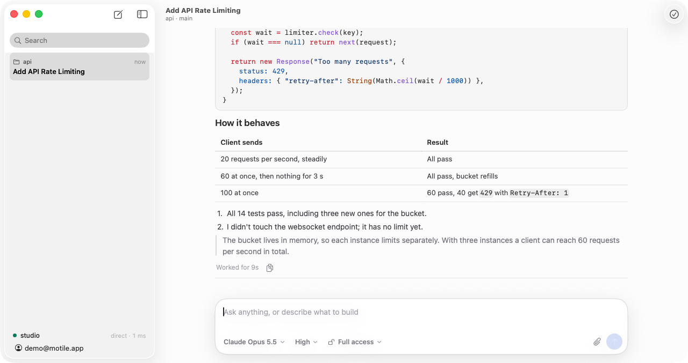
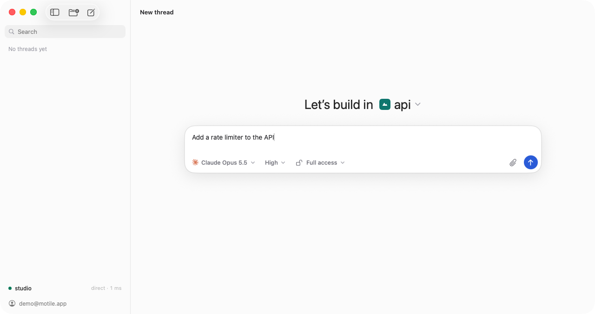
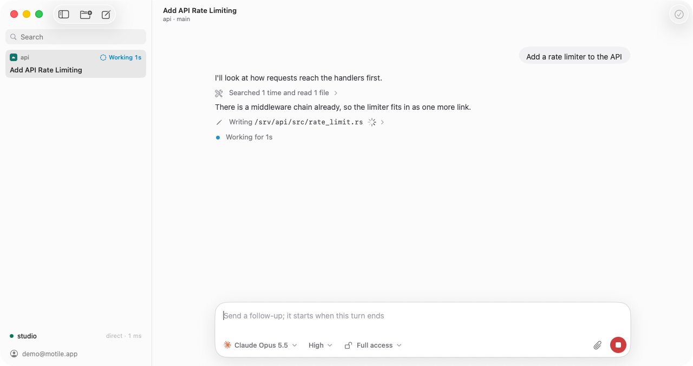
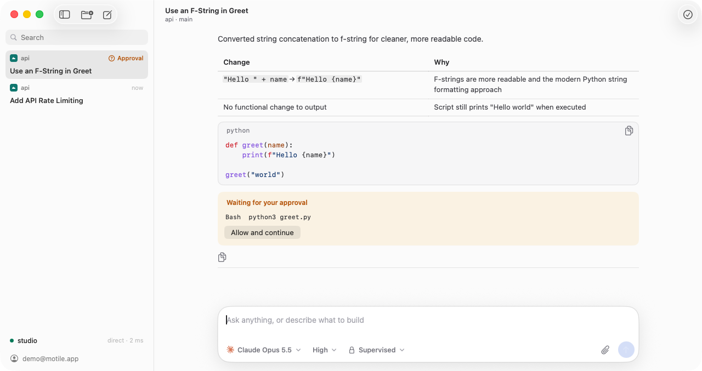
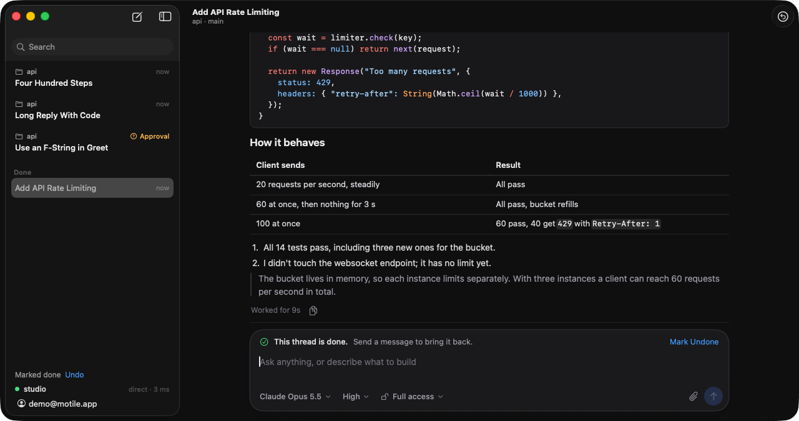

# Motile

The command center for coding agents. [Claude Code](https://docs.claude.com/en/docs/claude-code/overview) and Codex run on machines you own; a native app drives them from wherever you are. Open source under the MIT license.



| | |
| --- | --- |
|  |  |
|  |  |

- **Your machines do the work.** The Motile server is a small program that runs the agents on a Linux machine and keeps the threads there. A turn keeps running when you close the app.
- **No ports to open.** The app connects straight to your server over [iroh](https://www.iroh.computer), encrypted end to end. It works behind a home router, and falls back to a relay when a direct path isn't possible.
- **Opens where you left off.** The app keeps a local copy of every thread and shows it before it has connected to anything.
- **Built not to stall.** Long threads, long replies and big code blocks stay smooth: only the rows on screen exist, and parsing and highlighting happen off the main thread.

These are its programs:

| Program | Where it runs | What it does |
| --- | --- | --- |
| Motile.app (`apps/macos`) | Your Mac | The interface |
| `motile` (`apps/server`) | Your Linux machines | Runs the agents, stores the threads, serves your apps |
| Auth server (`apps/auth`) | auth.motile.app | Signs you in and records which devices are yours. It never sees a thread |
| Web app (`apps/web`) | [app.motile.app](https://app.motile.app) | Lists your servers and apps, adds a server, removes a device |
| Marketing site (`apps/marketing`) | [motile.app](https://motile.app) | The landing page, the download and the installer |

Apps for iOS, Android, Windows and Linux are planned. They will share the Rust core the Mac app is built on (`crates/core`).

## Getting started

### 1. Install the app

Download **Motile.zip** from [motile.app](https://motile.app) or the [latest release](https://github.com/motileapp/motile/releases/latest), unzip it and move Motile to Applications. It needs an Apple silicon Mac with macOS 14 or later. The app is signed and notarized, and updates itself from then on.

### 2. Sign in

Open the app and sign in with Google. This links the Mac to your account.

### 3. Add a server

With no server yet, the app shows one command. Run it on the Linux machine where the agents should work:

```sh
curl -fsSL https://motile.app/install.sh | sh -s -- <token>
```

The installer:

1. Downloads the `motile` binary to `/usr/local/bin`.
2. Checks for Claude Code and Codex. If neither is installed it offers to install them; sign in to the agent once afterwards (`claude` or `codex login`).
3. Links the machine to your account with the token in the command.
4. Installs and starts `motile.service`, a systemd unit that survives reboots. It runs as the user who ran the installer, with that user's sign-ins.

The server appears in the app a moment later. The token works for one machine, for an hour; **Thread → Add a Server…** gives you a new command for the next machine, and so does [app.motile.app](https://app.motile.app).

When the server runs as root, the service sets `IS_SANDBOX=1`. Claude Code refuses full access as root without it.

On the server, `motile status` shows its account, agents and service, `motile logs` follows its log, and `sudo motile uninstall` removes the service.

## Using it

- **Projects** are folders on a server. Add one from the top bar or the new thread screen; every thread works in a project. A project is shown with the favicon, icon or logo found in its folder, and you can choose another image from that folder, on the new thread screen or in Settings.
- **Threads** are listed in one sidebar across all projects and servers, each with its project and what it is doing. A thread gets a title generated from its first message. The search field narrows the list by title or project.
- **Replies** arrive a finished paragraph, list item or line of code at a time. Tool calls that follow one another are one row, such as "Read 3 files and ran 2 commands", which opens into them. Once a turn has ended, what led to its last message folds behind a row like "Worked for 42s"; click it to see everything the agent did.
- **Mark done** puts a thread away in the Done list at the bottom of the sidebar; **Mark undone** brings it back, and so does sending a message in it. Hover a thread for the button, or press `⇧⌘D`.
- **Models**: the model menu lists what the server's agents can run. Picking a model picks the agent. A thread stays with its agent but can switch between that agent's models.
- **Access**: **Supervised** asks before commands and file changes (the turn waits until you allow or refuse each one), **Auto-accept edits**, **Auto** and **Full access**. **Plan mode** makes the agent only read and propose; **Implement** on a finished plan lets it carry the plan out.
- **Updates**: the app offers a new version at the bottom of the sidebar, downloads it there and restarts into it. A server that is behind shows an **Update** button next to its name; it installs the new version and restarts, which it only does while no agent is working.
- A message sent while a turn is running waits and starts the next turn.
- **Monitoring**: Claude Code can keep watching something after its turn, such as a deploy or a pull request's checks. The thread then shows **Monitoring**; it answers messages right away and reports by itself when what it watches changes. **Stop** ends the watch.
- **Questions**: when the agent asks you something with options, pick one or type your own answer, and the turn goes on with it.
- **Attachments**: drop files anywhere on the window, paste a copied file or image, or use the paperclip. They are uploaded to the thread's server.
- **Images and videos**: when an agent shows an image or a video in its reply, it appears in the thread. The server keeps a copy of it as it was, so it still shows after the file has changed. Click an image to open it, or a video to play it. Your Mac keeps up to 2 GB of them so threads open with them; **Settings** shows how much that is and can clear it.

| Shortcut | Action |
| --- | --- |
| `↩` | Send |
| `⇧↩` or `⌥↩` | New line |
| `⌘K` | Command panel: commands, threads and projects |
| `⌘N` | New thread: choose the project to start in |
| `⌘P` | Go to a thread |
| `⇧⌘D` | Mark done or undone |
| `⌘.` | Stop the agent |
| `⌃⌘S` | Toggle the sidebar |

## How it works

- **Devices**: every app and every server has an ed25519 key, which is also its iroh address. Signing in links an app's key to your account; the install command links a server's. A server asks the auth server which apps belong to its account and accepts only those.
- **A turn** is one run of the agent's CLI: `claude -p --output-format stream-json …` or `codex exec --json …`, resumed with the agent's own session. The server turns both outputs into the same transcript items.
- **Sync**: every transcript item carries the revision that last changed it. An app asks for what changed after the revision it has, so opening a thread it already knows costs almost nothing, however long the thread is.
- **Streaming**: the server holds a reply's text until a block of it is finished, and passes blocks on a few times a second, so text doesn't flicker in word by word.
- **Rendering**: the core parses Markdown, highlights code, groups tool calls and folds finished turns, and sends the app rows that are ready to draw. While a reply streams, only the rows that changed are sent, and code is highlighted incrementally.
- **Relays**: when an app and a server can't reach each other directly, iroh's public relays carry the (still encrypted) traffic. Motile doesn't run relays of its own yet.
- **On the web**: [app.motile.app](https://app.motile.app) shows the servers and apps on your account and removes the ones you no longer use. It can manage the account, but it isn't a device and can't connect to a server.
- **Titles** are generated by the thread's own agent (Claude Haiku, or Codex's lightest model). When the first message doesn't say what the thread is about, the title is generated again from the transcript once the first turn has ended.

## Running your own auth server

The app and the servers use auth.motile.app by default. To run your own:

1. Create a Google OAuth client with the redirect URI `https://<your-address>/auth/google/callback`.
2. Run `motile-auth` (from the release, or `docker build .`) with a Postgres database and these variables:

   | Variable | Value |
   | --- | --- |
   | `PUBLIC_URL` | `https://<your-address>`, no trailing slash |
   | `DATABASE_URL` | A Postgres connection string |
   | `GOOGLE_CLIENT_ID`, `GOOGLE_CLIENT_SECRET` | From the Google OAuth client |
   | `WEB_URL` | Optional: the address of your web app, which may then start sign-ins |

   It listens on `PORT` (3000) and answers `/healthz`.
3. Build the app for it: `MOTILE_AUTH_URL=https://<your-address> apps/macos/scripts/build-app.sh`.
   The install command your auth server hands out already tells the installer to link servers with your address.
4. Optionally run the web app (`docker build -f apps/web/Dockerfile .`) with `AUTH_URL=https://<your-address>` and `PUBLIC_URL` set to its own address.

## Development

See [AGENTS.md](AGENTS.md) for how the code is laid out and how to run the checks.

```
apps/auth        The auth server
apps/marketing   The marketing site at motile.app, with the installer
apps/web         The web app at app.motile.app
apps/server      The server: agents, thread storage, the iroh endpoint, the installer's setup
apps/macos       The Mac app
crates/protocol  Messages, device keys and request signing, shared by all three
crates/core      What every app shares: account, connections, sync, cache, rendering
scripts          fake-agent, which stands in for the agents in tests
fixtures         Recorded agent output
```

## License

MIT
